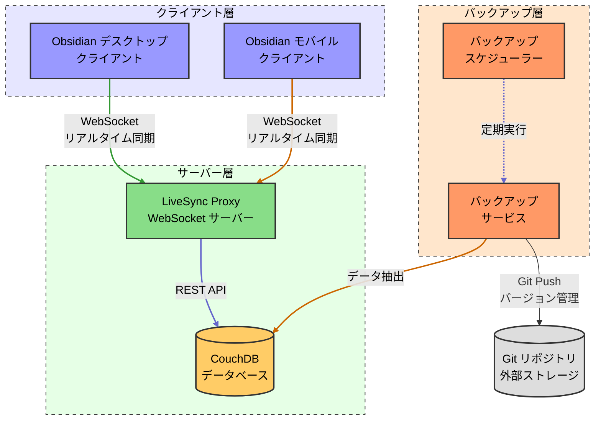

# obsidian-sync

Obsidian のナレッジベースを複数デバイス間でリアルタイム同期するための完全なソリューションです。  
Docker コンテナでパッケージされた CouchDB と専用 WebSocket プロキシを使用して、セキュアでシームレスな同期環境を提供します。

## Overview

Obsidian の LiveSync プラグインを使用して、複数のデバイス間でスムーズにノートを同期するための Docker ベースの環境です。  
CouchDB と WebSocket プロキシを使用して、セキュアで高速な同期を実現します。



## Requirements

- Docker Engine 20.x 以降または Docker Desktop 最新版
- Docker Compose v2（`docker compose` コマンド）
- 開発時：Rust 1.86.0 以降

## Quick Start

1. リポジトリをクローン：
   ```bash
   git clone <リポジトリURL>
   cd obsidian-sync
   ```

2. 環境変数ファイルを作成：
   ```bash
   cp .env.example .env
   # エディタで .env を開き、パスワードなどを変更してください
   ```

3. Docker Compose でサービスを起動：
   ```bash
   # 開発モード
   docker compose up --build
   
   # 本番モード（バックグラウンド起動）
   docker compose up -d
   ```

4. ブラウザで以下の URL にアクセス：
   - LiveSync Proxy: http://localhost:3000
   - CouchDB 管理画面: http://localhost:5984/_utils/

## Configuration

`.env` ファイルで以下の環境変数を設定できます：

| 環境変数 | 説明 | デフォルト値 | 必須 |
|----------|------|-------------|------|
| `COMPOSE_PROJECT_NAME` | Docker コンポーズプロジェクト名 | obsidian-sync | いいえ |
| `HOST_COUCHDB_PORT` | CouchDB のホスト側ポート | 5984 | いいえ |
| `HOST_PROXY_PORT` | Proxy のホスト側ポート | 3000 | いいえ |
| `COUCHDB_USER` | CouchDB 管理者ユーザー名 | admin | はい |
| `COUCHDB_PASSWORD` | CouchDB 管理者パスワード | change_this_password | はい |
| `BACKUP_SCHEDULE` | バックアップスケジュール（Cron 形式） | 0 2 * * * | いいえ |
| `BACKUP_RUN_ON_STARTUP` | 起動時にバックアップを実行するか | false | いいえ |
| `BACKUP_GIT_REPO` | バックアップ先 Git リポジトリ | なし | はい |
| `BACKUP_GIT_BRANCH` | Git リポジトリのブランチ | main | いいえ |
| `BACKUP_GIT_TOKEN` | Git リポジトリアクセス Token | なし | はい |

## Obsidian LiveSync Setup

Obsidian アプリ内で LiveSync プラグインをインストールし、以下のように設定してください：

1. リモートデータベースタイプ: WebSocket サーバー
2. WebSocket URL: `ws://[サーバーの IP またはホスト名]:3000/db`

## Backup

本システムには自動バックアップ機能が組み込まれています。デフォルトでは毎日日本時間の午前2時にバックアップが実行され、Git リポジトリに保存されます。

### 自動バックアップの設定

`.env` ファイルで以下の設定が可能です：

```
# バックアップスケジュール（CRON 形式）- 日本時間で実行されます
BACKUP_SCHEDULE=0 2 * * *  # 毎日午前2時に実行

# Git リポジトリ設定
BACKUP_GIT_REPO=https://github.com/username/obsidian-backup.git
BACKUP_GIT_BRANCH=main
BACKUP_GIT_TOKEN=ghp_xxxxxxxxxxxxxxxxxxxx
```

### 手動バックアップの実行

バックアップを手動で実行するには：

```bash
# Git リポジトリへのバックアップを実行
docker compose run backup
```

### 従来の方法（ローカルバックアップのみ）

ローカルディスクのみにバックアップする場合：

```bash
# CouchDB のデータボリュームをエクスポート
docker run --rm -v obsidian-sync_couchdb_data:/data -v $(pwd)/backup:/backup \
  alpine tar -czf /backup/couchdb_data_$(date +%Y%m%d).tar.gz -C /data .
```

## Project Structure

```
obsidian-sync/
├── backup/            # バックアップ関連ファイル
│   ├── backup.sh      # バックアップスクリプト
│   ├── Dockerfile     # バックアップサービス用 Docker 設定
│   └── Dockerfile.scheduler # スケジューラ用 Docker 設定
├── couchdb/           # CouchDB 関連ファイル
├── docs/              # ドキュメント
├── livesync-proxy/    # プロキシサーバー（Rust）
└── compose.yaml       # Docker コンポーズ定義
```

## Development

開発環境のセットアップと貢献方法については、[開発者ガイド](docs/developer-guide.md)を参照してください。

## More Information

詳細な仕様や設定方法については、[仕様書](docs/specification.md)を参照してください。
