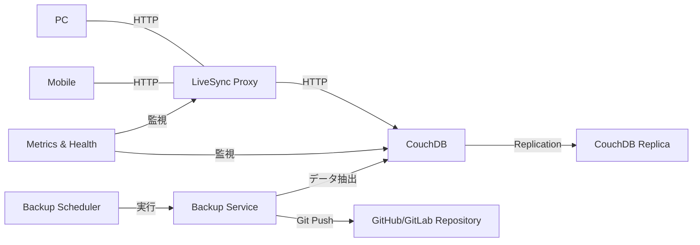

# obsidian-sync プロジェクト仕様

---

## 1. 概要

* **目的**：Obsidian LiveSync プラグイン＋CouchDB でリアルタイム同期環境を構築
* **コンテナ管理**：Docker／Docker Compose v2（`compose.yaml`）で完全コンテナ化
* **主要設定**：`.env` 一元管理（プロジェクト名／Compose ファイル／ポート／認証情報）
* **プロキシ実装**：Rust言語によるHTTPプロキシ（livesync-proxy）で高速・安定動作

---

## 2. 要件

* Docker Engine 20.x 以降 or Docker Desktop 最新版
* Docker Compose v2（`docker compose` コマンド）
* ネットワーク：ホスト→コンテナ間のポートマッピング（CouchDB と LiveSync Proxy）
* Rust実行環境（開発時のみ）：Rustコンパイラとcargo

---

## 3. アーキテクチャ



---

## 4. サービス構成

| サービス               | イメージ／ビルド                     | コンテナ側ポート | ホスト側ポート（`.env`）        |
| ------------------ | ---------------------------- | -------- | ---------------------- |
| **couchdb**        | カスタムビルド (`apache/couchdb:latest`ベース)      | 5984     | `${HOST_COUCHDB_PORT}` |
| **livesync-proxy** | マルチステージビルド (Rust → Debian slim)   | 3000     | `${HOST_PROXY_PORT}`   |
| **backup**         | Alpine Linux ベース                | -        | -                      |
| **backup-scheduler** | Alpine Linux ベース + crond       | -        | -                      |

* CouchDB は Named Volume で永続化
* CouchDB 起動時に必要なシステムデータベースを自動初期化
* Proxy はマルチステージビルドで軽量化 (Rustコードをビルド後、最小限の実行環境にコピー)
* バックアップサービスは軽量Alpine Linuxベースで、Git/シェルスクリプトを使用
* バックアップスケジューラーは crond を使用し、設定したスケジュールでバックアップを実行
* ヘルスチェック機能搭載 (主要サービスにコンテナのヘルスチェック機能を実装)

---

## 5. Compose設定

* **`compose.yaml`**: 基本構成（開発環境・共通設定）
  * CouchDBサービス: カスタムDockerfileからビルド
  * LiveSync Proxyサービス: Rustアプリケーションのマルチステージビルド
  * バックアップスケジューラーサービス: バックアップの定期実行を管理
  * 依存関係設定（Proxyはデータベース起動後に開始）
  * 環境変数による設定の柔軟性（`.env`ファイルから自動読み込み）
  * ヘルスチェック設定による信頼性確保
  * ボリューム設定によるデータ永続化
  * バックアップサービスはコンポーズから自動起動しない設定（profiles: ["manual"]）

* **`compose.prod.yaml`**: 本番環境向け追加設定
  * `always`再起動ポリシー（より強固な可用性）
  * ログローテーション設定（ディスク容量管理）
  * バックアップスケジューラーの強化設定

---

## 6. 環境設定

**`.env`ファイルによる環境変数管理**:

* プロジェクト設定（名前・Composeファイル指定）
* ポート設定（ホスト側公開ポート）
* 認証情報（CouchDBユーザー名・パスワード、Gitトークン）
* バックアップ設定（スケジュール、Git情報）
* バージョン設定（必要に応じて）
* デバッグオプション（開発時）

**バックアップ関連の環境変数**:

```
# バックアップスケジュール（CRON形式）
BACKUP_SCHEDULE=0 2 * * *  # 毎日午前2時に実行

# Gitリポジトリ設定
BACKUP_GIT_REPO=https://github.com/username/obsidian-backup.git
BACKUP_GIT_BRANCH=main
BACKUP_GIT_TOKEN=ghp_xxxxxxxxxxxxxxxxxxxx
BACKUP_COMMIT_MSG_PREFIX=[Backup]
```

---

## 7. 運用手順

**基本的な起動手順**:

* `.env.example`をコピーして`.env`として編集
* 開発モード: `docker compose up --build`でコンテナ起動＆ログ表示
* 本番モード: `docker compose up -d`でバックグラウンド起動

**バックアップ操作**:

* 自動バックアップ: バックアップスケジューラーが`.env`のCRON設定に基づいて自動実行
* 手動バックアップ実行: `docker compose run backup`（通常のコンテナ起動では実行されない）
* バックアップ履歴確認: Gitリポジトリのコミット履歴で確認可能

**管理ポイント**:
* 環境変数で柔軟な設定（`.env`ファイル）
* Gitトークンなどの秘密情報はGitリポジトリから除外
* 複数環境への対応（開発・本番）

---

## 8. バックアップ・セキュリティ

### バックアップシステム

* **役割分担**:
  * `backup`: データバックアップとGitリポジトリへのプッシュを実行するサービス（手動実行のみ）
  * `backup-scheduler`: スケジュールに基づいて`backup`サービスを起動するサービス

* **実行フロー**:
  1. スケジューラーが設定されたCRON時間に起動、または手動で`backup`サービスを実行
  2. `couchdb_data` ボリュームのエクスポート
  3. Vault ファイルのバックアップ
  4. バックアップファイルをGitリポジトリに自動コミット
  5. GitHub/GitLabなどへの自動プッシュ

* **スケジューリング**:
  * Cronベースの定期実行（`.env`でスケジュール設定）
  * `backup-scheduler`サービスが`backup`サービスを定期的に起動
  * 手動実行オプション（`docker compose run backup`）

* **設定オプション**（`.env`で指定）:
  * `BACKUP_SCHEDULE`: Cron形式でのバックアップスケジュール（例: `0 2 * * *`）
  * `BACKUP_GIT_REPO`: バックアップ先のGitリポジトリURL
  * `BACKUP_GIT_BRANCH`: 使用するGitブランチ（デフォルト: `main`）
  * `BACKUP_GIT_TOKEN`: GitHub/GitLab APIトークン
  * `BACKUP_COMMIT_MSG_PREFIX`: コミットメッセージ接頭辞（デフォルト: `[Backup]`）

### セキュリティ対策

* **TLS 化**：必要に応じリバースプロキシで HTTPS 終端
* **E2E 暗号化**：Vault 側で LiveSync の暗号化を有効化
* **自動ヘルスチェック**：両サービスにDockerコンテナヘルスチェック機能を実装
* **システムDB初期化**：CouchDBコンテナ起動時にシステムデータベース（_users, _replicator等）を自動作成

---

## 9. CI/CD 連携

1. livesync-proxy のビルド＆テスト（Rustユニットテスト、統合テスト）
2. Docker イメージのビルド＆プッシュ（マルチステージビルドでイメージサイズ最適化）
3. デプロイ先で `docker compose pull && docker compose up -d` を実行
4. メトリクスとモニタリング機能による継続的な運用監視
